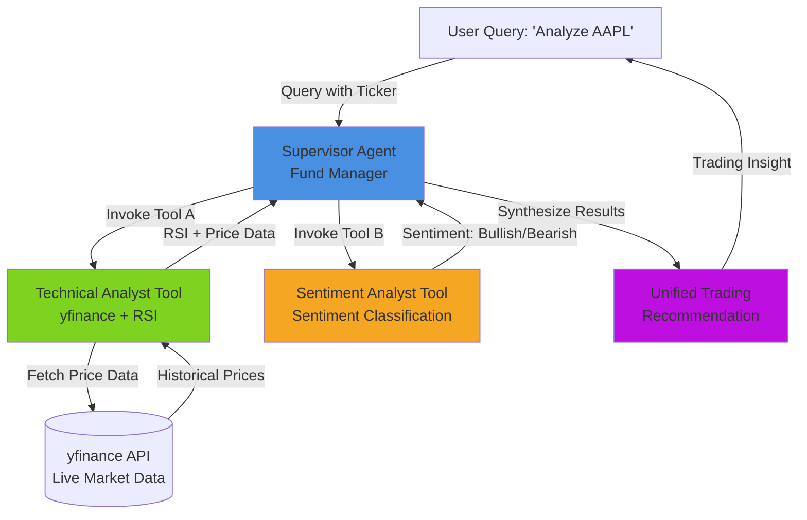
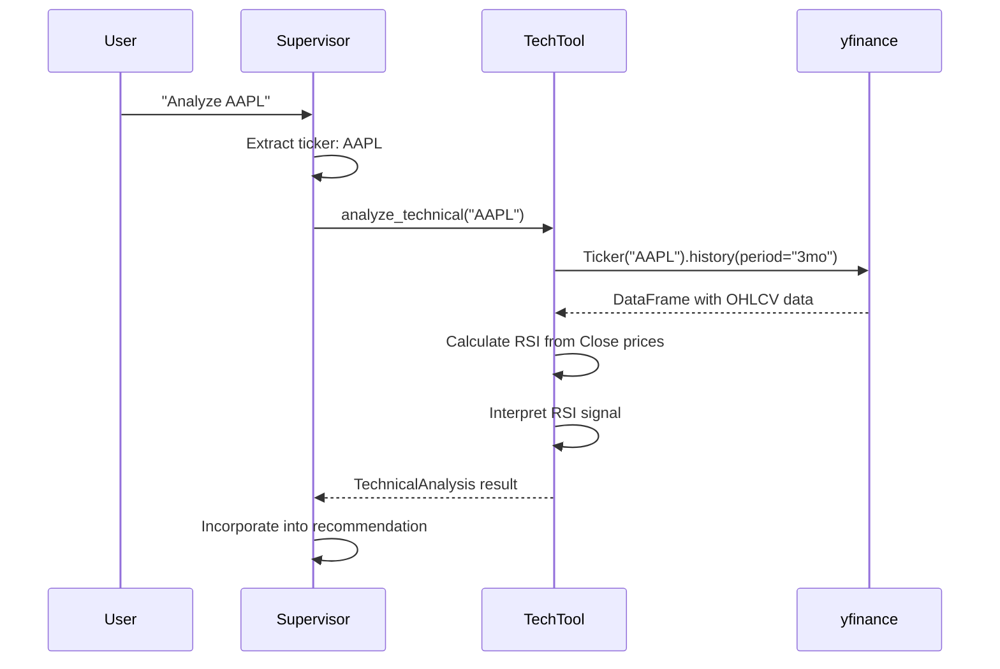
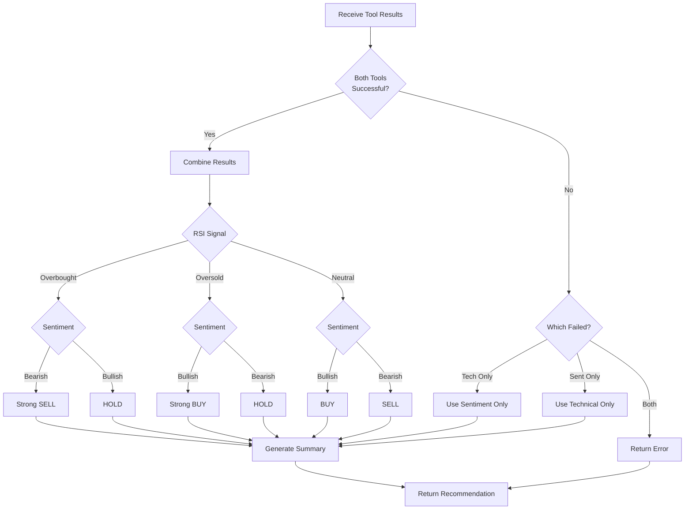

# Design Document

## Overview

The Multi-Agentic Trading Supervisor is a serverless, AI-powered trading analysis system that leverages a supervisor-agent architecture to orchestrate multiple specialized analytical tools. The system is designed to run on AWS Bedrock Agents, providing scalable, real-time trading insights by combining technical analysis (RSI calculations from live market data) with sentiment analysis.

The architecture follows a hub-and-spoke pattern where the Supervisor Agent acts as the central orchestrator, intelligently routing user queries to appropriate specialized tools (Technical Analyst and Sentiment Analyst), then synthesizing their outputs into actionable trading recommendations.

## Architecture

### High-Level Architecture



### System Flow

1. **User Input**: User submits a query containing a stock ticker (e.g., "Analyze AAPL")
2. **Query Parsing**: Supervisor Agent extracts the ticker symbol and determines which tools to invoke
3. **Parallel Tool Invocation**: Supervisor calls Technical Analyst and Sentiment Analyst tools concurrently
4. **Data Retrieval**: Technical Analyst fetches live data from yfinance API
5. **Analysis**: Each tool performs its specialized analysis (RSI calculation, sentiment classification)
6. **Result Synthesis**: Supervisor combines tool outputs into a coherent recommendation
7. **Response Delivery**: Unified trading insight returned to user

### AWS Bedrock Integration

The system is structured to be compatible with AWS Bedrock Agents:
- Lambda handler function serves as the entry point
- Tools are registered with proper OpenAPI-style schemas
- Event/response formats conform to Bedrock Agent specifications
- Stateless design enables horizontal scaling

## Components and Interfaces

### 1. Supervisor Agent

**Responsibility**: Orchestrate tool calls and synthesize results

**Key Methods**:
- `handle_query(query: str) -> dict`: Main entry point for processing user queries
- `extract_ticker(query: str) -> str`: Parse ticker symbol from natural language query
- `determine_tools(query: str) -> list[str]`: Decide which tools to invoke based on query content
- `synthesize_results(tech_result: dict, sent_result: dict) -> dict`: Combine tool outputs into final recommendation

**Input Format**:
```python
{
    "query": "Analyze AAPL",
    "user_id": "optional_user_identifier"
}
```

**Output Format**:
```python
{
    "ticker": "AAPL",
    "recommendation": "BUY|SELL|HOLD",
    "technical_analysis": {
        "rsi": 65.4,
        "current_price": 178.50,
        "signal": "Neutral"
    },
    "sentiment_analysis": {
        "sentiment": "Bullish",
        "confidence": 0.75
    },
    "summary": "Combined analysis suggests..."
}
```

### 2. Technical Analyst Tool

**Responsibility**: Fetch live market data and calculate RSI

**Key Methods**:
- `analyze_technical(ticker: str) -> dict`: Main analysis function
- `fetch_price_data(ticker: str, period: str = "3mo") -> pd.DataFrame`: Retrieve historical prices
- `calculate_rsi(prices: pd.Series, period: int = 14) -> float`: Compute RSI indicator
- `interpret_rsi(rsi_value: float) -> str`: Classify RSI as Overbought/Oversold/Neutral

**Dependencies**: yfinance, pandas, numpy

**API Integration**: Uses yfinance for real-time market data with retry logic and timeout handling

**RSI Calculation Logic**:
```
1. Calculate price changes (deltas)
2. Separate gains and losses
3. Calculate average gain and average loss over 14 periods
4. RS = Average Gain / Average Loss
5. RSI = 100 - (100 / (1 + RS))
```

**RSI Interpretation**:
- RSI > 70: Overbought (potential sell signal)
- RSI < 30: Oversold (potential buy signal)
- 30 ≤ RSI ≤ 70: Neutral

**Output Format**:
```python
{
    "ticker": "AAPL",
    "current_price": 178.50,
    "rsi": 65.4,
    "rsi_signal": "Neutral",
    "price_change_24h": 2.3,
    "timestamp": "2025-11-28T10:30:00Z"
}
```

### 3. Sentiment Analyst Tool

**Responsibility**: Provide sentiment classification for a ticker using real news data

**Key Methods**:
- `analyze_sentiment(ticker: str, api_key: Optional[str]) -> dict`: Main sentiment analysis function
- `fetch_news_sentiment(ticker: str, api_key: Optional[str]) -> dict`: Fetch news from Alpha Vantage API
- `calculate_aggregate_sentiment(sentiment_data: dict, ticker: str) -> tuple`: Calculate aggregate sentiment from news articles

**Implementation**: Uses Alpha Vantage News Sentiment API to fetch real-time news articles and calculate sentiment based on ticker-specific sentiment scores and relevance. Implements exponential backoff retry logic for API reliability.

**Output Format**:
```python
{
    "ticker": "AAPL",
    "sentiment": "Bullish",
    "confidence": 0.75,
    "rationale": "Based on 15 recent news articles, average sentiment score is 0.234 (positive)",
    "timestamp": "2025-11-28T10:30:00Z"
}
```

### 4. AWS Lambda Handler

**Responsibility**: Bridge between AWS Bedrock and application logic

**Key Methods**:
- `lambda_handler(event: dict, context: object) -> dict`: AWS Lambda entry point
- `parse_bedrock_event(event: dict) -> dict`: Extract query from Bedrock event format
- `format_bedrock_response(result: dict) -> dict`: Format response for Bedrock

**Event Format** (AWS Bedrock Agent):
```python
{
    "messageVersion": "1.0",
    "agent": {
        "name": "TradingSupervisor",
        "id": "agent-id",
        "alias": "prod",
        "version": "1"
    },
    "inputText": "Analyze AAPL",
    "sessionId": "session-123",
    "sessionAttributes": {},
    "promptSessionAttributes": {}
}
```

## Data Models

### Query Model
```python
@dataclass
class Query:
    text: str
    ticker: Optional[str] = None
    user_id: Optional[str] = None
    session_id: Optional[str] = None
```

### Technical Analysis Result
```python
@dataclass
class TechnicalAnalysis:
    ticker: str
    current_price: float
    rsi: float
    rsi_signal: str  # "Overbought" | "Oversold" | "Neutral"
    price_change_24h: float
    timestamp: datetime
    error: Optional[str] = None
```

### Sentiment Analysis Result
```python
@dataclass
class SentimentAnalysis:
    ticker: str
    sentiment: str  # "Bullish" | "Bearish"
    confidence: float
    rationale: str
    timestamp: datetime
    error: Optional[str] = None
```

### Trading Recommendation
```python
@dataclass
class TradingRecommendation:
    ticker: str
    recommendation: str  # "BUY" | "SELL" | "HOLD"
    technical_analysis: TechnicalAnalysis
    sentiment_analysis: SentimentAnalysis
    summary: str
    confidence: float
    timestamp: datetime
```

## Data Flow

### 1. Market Data Flow



### 2. Decision Synthesis Flow




## Correctness Properties

*A property is a characteristic or behavior that should hold true across all valid executions of a system—essentially, a formal statement about what the system should do. Properties serve as the bridge between human-readable specifications and machine-verifiable correctness guarantees.*

### Property 1: Ticker extraction correctness
*For any* user query containing a valid stock ticker symbol, the Supervisor Agent should correctly extract and identify the ticker symbol regardless of query phrasing or surrounding text.
**Validates: Requirements 1.1**

### Property 2: Dual tool invocation
*For any* general analysis query with a ticker symbol, the Supervisor Agent should invoke both the Technical Analyst Tool and the Sentiment Analyst Tool.
**Validates: Requirements 1.2**

### Property 3: Complete recommendation synthesis
*For any* pair of tool results (technical and sentiment), the Supervisor Agent should produce a trading recommendation containing all required fields: ticker, recommendation type, technical analysis data, sentiment analysis data, and summary.
**Validates: Requirements 1.3, 6.4**

### Property 4: Invalid ticker rejection
*For any* invalid or malformed ticker symbol, the Supervisor Agent should return an error response indicating the ticker is not recognized, without attempting analysis.
**Validates: Requirements 1.4**

### Property 5: Technical data retrieval
*For any* valid ticker symbol, when the Technical Analyst Tool is invoked, it should attempt to retrieve price data from yfinance.
**Validates: Requirements 2.1**

### Property 6: RSI calculation presence
*For any* successfully retrieved price dataset with sufficient history, the Technical Analyst Tool should calculate and return an RSI value.
**Validates: Requirements 2.2**

### Property 7: Technical output completeness
*For any* successful technical analysis, the output should contain both the RSI value and current price information.
**Validates: Requirements 2.3**

### Property 8: Sentiment classification validity
*For any* ticker symbol, the Sentiment Analyst Tool should return a sentiment classification that is either "Bullish" or "Bearish".
**Validates: Requirements 3.1**

### Property 9: Sentiment determinism
*For any* ticker symbol, calling the Sentiment Analyst Tool multiple times with the same ticker should produce identical results (same sentiment and confidence score).
**Validates: Requirements 3.2, 3.4**

### Property 10: Sentiment output completeness
*For any* sentiment analysis result, the output should include both a confidence score and a rationale for the classification.
**Validates: Requirements 3.3**

### Property 11: Bedrock event parsing
*For any* valid AWS Bedrock Agent event format, the Lambda handler should correctly parse and extract the user query.
**Validates: Requirements 4.3**

### Property 12: Bedrock response formatting
*For any* trading recommendation generated by the system, the Lambda handler should format it according to AWS Bedrock Agent response specifications.
**Validates: Requirements 4.4**

### Property 13: Query-based tool selection (technical keywords)
*For any* user query containing technical analysis keywords (e.g., "RSI", "technical", "price", "momentum"), the Supervisor Agent should invoke the Technical Analyst Tool.
**Validates: Requirements 6.1**

### Property 14: Query-based tool selection (sentiment keywords)
*For any* user query containing sentiment keywords (e.g., "sentiment", "news", "bullish", "bearish"), the Supervisor Agent should invoke the Sentiment Analyst Tool.
**Validates: Requirements 6.2**

### Property 15: Default comprehensive analysis
*For any* general query without specific tool keywords (e.g., "Analyze AAPL"), the Supervisor Agent should invoke both tools.
**Validates: Requirements 6.3**

### Property 16: Graceful degradation on tool failure
*For any* scenario where one tool fails, the Supervisor Agent should continue processing with the available tool results and clearly indicate which tool failed in the response.
**Validates: Requirements 6.5**

### Property 17: Input validation
*For any* input that is not a valid query format (wrong type, missing required fields), the system should validate the input and return a clear error message without crashing.
**Validates: Requirements 7.3**

### Property 18: RSI bounds invariant
*For any* price dataset, the calculated RSI value should always be within the valid range of 0 to 100 (inclusive).
**Validates: Requirements 8.3**

### Property 19: RSI formula correctness
*For any* price dataset with sufficient history, the RSI calculation should match the result from a reference implementation using the standard formula: RSI = 100 - (100 / (1 + RS)), where RS is the ratio of average gains to average losses over 14 periods.
**Validates: Requirements 8.5**

## Error Handling

### Error Categories

1. **Input Validation Errors**
   - Invalid ticker symbols
   - Malformed queries
   - Missing required fields
   - Response: HTTP 400 with descriptive error message

2. **External API Errors**
   - yfinance API unavailable
   - Network connectivity issues
   - Rate limiting
   - Response: HTTP 503 with retry guidance

3. **Data Quality Errors**
   - Insufficient historical data for RSI
   - Empty price data returned
   - Missing required data fields
   - Response: HTTP 422 with explanation of data issue

4. **Tool Execution Errors**
   - Tool invocation failures
   - Timeout errors
   - Unexpected exceptions
   - Response: Partial results with error indication

### Error Handling Strategy

```python
class TradingSystemError(Exception):
    """Base exception for trading system"""
    pass

class InvalidTickerError(TradingSystemError):
    """Raised when ticker symbol is invalid"""
    pass

class InsufficientDataError(TradingSystemError):
    """Raised when not enough data for analysis"""
    pass

class ExternalAPIError(TradingSystemError):
    """Raised when external API fails"""
    pass

class ToolExecutionError(TradingSystemError):
    """Raised when a tool fails to execute"""
    pass
```

### Error Response Format

```python
{
    "success": False,
    "error": {
        "code": "INVALID_TICKER",
        "message": "Ticker symbol 'XYZ123' is not recognized",
        "details": "Please provide a valid stock ticker symbol",
        "timestamp": "2025-11-28T10:30:00Z"
    },
    "partial_results": None  # or partial data if available
}
```

### Retry Logic

- **yfinance API calls**: 3 retries with exponential backoff (1s, 2s, 4s)
- **Tool invocations**: 2 retries with 1s delay
- **Timeout values**: 
  - yfinance data fetch: 10 seconds
  - Individual tool execution: 15 seconds
  - Total request timeout: 30 seconds

## Testing Strategy

### Unit Testing

The system will use **pytest** as the primary testing framework for unit tests. Unit tests will focus on:

1. **Ticker Extraction Logic**
   - Test parsing of various query formats
   - Test edge cases like multiple tickers in one query
   - Test queries without tickers

2. **RSI Calculation**
   - Test with known price sequences
   - Test boundary conditions (exactly 14 data points)
   - Test with sample data from financial datasets

3. **Sentiment Classification**
   - Test deterministic behavior with same inputs
   - Test output format consistency
   - Test confidence score ranges

4. **Error Handling**
   - Test each error type is raised appropriately
   - Test error message clarity
   - Test graceful degradation scenarios

5. **AWS Integration**
   - Test Bedrock event parsing with sample events
   - Test response formatting
   - Test Lambda handler entry point

### Property-Based Testing

The system will use **Hypothesis** (Python's property-based testing library) to verify universal properties. Each property-based test will:

- Run a minimum of 100 iterations with randomly generated inputs
- Be tagged with a comment referencing the specific correctness property from this design document
- Use the format: `# Feature: multi-agent-trading-supervisor, Property {number}: {property_text}`

**Property-Based Test Coverage:**

1. **Property 1 (Ticker Extraction)**: Generate random queries with embedded tickers, verify extraction
2. **Property 2 (Dual Tool Invocation)**: Generate random tickers, verify both tools called
3. **Property 3 (Complete Synthesis)**: Generate random tool results, verify all fields present
4. **Property 4 (Invalid Ticker)**: Generate invalid ticker strings, verify error responses
5. **Property 8 (Sentiment Validity)**: Generate random tickers, verify sentiment is Bullish/Bearish
6. **Property 9 (Determinism)**: Generate random tickers, call multiple times, verify consistency
7. **Property 18 (RSI Bounds)**: Generate random price data, verify 0 ≤ RSI ≤ 100
8. **Property 19 (RSI Formula)**: Generate random price data, compare with reference implementation

**Test Data Generators (Hypothesis Strategies):**

```python
from hypothesis import strategies as st

# Generate valid ticker symbols (1-5 uppercase letters)
ticker_strategy = st.text(
    alphabet=st.characters(whitelist_categories=('Lu',)),
    min_size=1,
    max_size=5
)

# Generate price data (positive floats)
price_strategy = st.floats(min_value=1.0, max_value=10000.0, allow_nan=False)

# Generate price series for RSI calculation
price_series_strategy = st.lists(
    price_strategy,
    min_size=20,  # Enough for RSI calculation
    max_size=100
)

# Generate queries with embedded tickers
query_strategy = st.builds(
    lambda ticker, prefix, suffix: f"{prefix} {ticker} {suffix}",
    ticker=ticker_strategy,
    prefix=st.sampled_from(["Analyze", "What about", "Tell me about", "Check"]),
    suffix=st.sampled_from(["stock", "please", "now", ""])
)
```

### Integration Testing

Integration tests will verify:

1. **End-to-End Flow**: User query → Supervisor → Tools → Response
2. **yfinance Integration**: Actual API calls with real tickers (using test tickers like AAPL, MSFT)
3. **AWS Bedrock Compatibility**: Deploy to test Lambda environment and verify with Bedrock Agent

### Test Organization

```
tests/
├── unit/
│   ├── test_supervisor.py
│   ├── test_technical_tool.py
│   ├── test_sentiment_tool.py
│   └── test_lambda_handler.py
├── property/
│   ├── test_properties_supervisor.py
│   ├── test_properties_technical.py
│   └── test_properties_sentiment.py
└── integration/
    ├── test_end_to_end.py
    └── test_yfinance_integration.py
```

### Test Execution

- Unit tests: Run on every commit
- Property-based tests: Run on every commit (100 iterations each)
- Integration tests: Run before deployment
- Coverage target: 85% code coverage minimum

## Deployment Architecture

### AWS Lambda Configuration

```yaml
Runtime: Python 3.11
Memory: 512 MB
Timeout: 30 seconds
Environment Variables:
  - LOG_LEVEL: INFO
  - RSI_PERIOD: 14
  - YFINANCE_TIMEOUT: 10
```

### Dependencies (requirements.txt)

```
yfinance>=0.2.32
pandas>=2.1.0
numpy>=1.24.0
requests>=2.31.0
boto3>=1.28.0
python-dateutil>=2.8.2
pytest>=7.4.0
hypothesis>=6.82.0
```

### Bedrock Agent Configuration

```json
{
  "agentName": "TradingSupervisor",
  "description": "Multi-agentic trading analysis system",
  "instruction": "You are a fund manager that analyzes stocks using technical and sentiment analysis tools.",
  "actionGroups": [
    {
      "actionGroupName": "TradingTools",
      "description": "Tools for stock analysis",
      "actionGroupExecutor": {
        "lambda": "arn:aws:lambda:region:account:function:trading-supervisor"
      },
      "apiSchema": {
        "payload": "openapi: 3.0.0..."
      }
    }
  ]
}
```

## Performance Considerations

### Latency Targets

- Ticker extraction: < 10ms
- yfinance data fetch: < 5 seconds
- RSI calculation: < 100ms
- Sentiment analysis: < 50ms
- Total end-to-end: < 10 seconds

### Optimization Strategies

1. **Parallel Tool Execution**: Use `asyncio` or `concurrent.futures` to call tools concurrently
2. **Caching**: Cache yfinance data for 5 minutes to reduce API calls
3. **Connection Pooling**: Reuse HTTP connections for yfinance
4. **Lambda Warm-up**: Keep Lambda instances warm to avoid cold starts

### Scalability

- Stateless design enables horizontal scaling
- Each request is independent
- No shared state between invocations
- Can handle concurrent requests through Lambda scaling

## Security Considerations

1. **Input Validation**: Sanitize all user inputs to prevent injection attacks
2. **API Rate Limiting**: Respect yfinance rate limits to avoid blocking
3. **Error Message Sanitization**: Don't expose internal system details in error messages
4. **Logging**: Log all requests but sanitize sensitive data
5. **IAM Roles**: Use least-privilege IAM roles for Lambda execution

## Future Enhancements

1. **Real Sentiment Analysis**: Integrate with news APIs (Alpha Vantage, NewsAPI) or social media sentiment
2. **Additional Technical Indicators**: MACD, Bollinger Bands, Moving Averages
3. **Backtesting Tool**: Historical performance analysis
4. **Portfolio Management**: Multi-stock analysis and portfolio optimization
5. **Real-time Streaming**: WebSocket support for live price updates
6. **Machine Learning**: Predictive models for price forecasting
7. **Risk Assessment Tool**: Calculate VaR, Sharpe ratio, beta
8. **Multi-timeframe Analysis**: Support for different time horizons (intraday, weekly, monthly)
