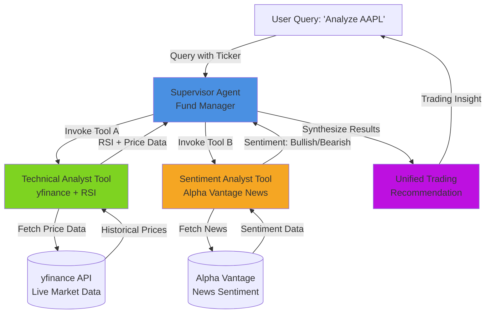

# Multi-Agentic Trading Supervisor

A serverless, AI-powered trading analysis system that leverages a supervisor-agent architecture to orchestrate multiple specialized analytical tools. Built for AWS Bedrock Agents, this system combines technical analysis (RSI calculations) with sentiment analysis to provide comprehensive trading recommendations.

## 🎯 Overview

The Multi-Agentic Trading Supervisor democratizes hedge-fund grade AI trading capabilities by employing a supervisor agent that orchestrates specialized sub-agents:

- **Supervisor Agent**: Central orchestrator that intelligently routes queries and synthesizes results
- **Technical Analyst Tool**: Fetches live market data from yfinance and calculates RSI indicators
- **Sentiment Analyst Tool**: Analyzes real-time news sentiment from Alpha Vantage API

### Key Features

✅ Natural language query understanding  
✅ Intelligent tool selection based on query keywords  
✅ Multi-source data fusion (yfinance + Alpha Vantage)  
✅ Decision synthesis (RSI + Sentiment → BUY/SELL/HOLD)  
✅ Graceful degradation when tools fail  
✅ Property-based testing for correctness guarantees  
✅ AWS Bedrock Agent compatible  

## 🏗️ Architecture



### System Flow

1. **User Input**: User submits a query containing a stock ticker (e.g., "Analyze AAPL")
2. **Query Parsing**: Supervisor Agent extracts the ticker symbol and determines which tools to invoke
3. **Parallel Tool Invocation**: Supervisor calls Technical Analyst and Sentiment Analyst tools
4. **Data Retrieval**: Tools fetch live data from yfinance and Alpha Vantage APIs
5. **Analysis**: Each tool performs its specialized analysis (RSI calculation, sentiment classification)
6. **Result Synthesis**: Supervisor combines tool outputs into a coherent recommendation
7. **Response Delivery**: Unified trading insight returned to user

## 📦 Project Structure

```
.
├── src/                          # Source code
│   ├── __init__.py
│   ├── models.py                 # Data models (Query, TechnicalAnalysis, etc.)
│   ├── supervisor.py             # Supervisor Agent orchestration logic
│   ├── lambda_handler.py         # AWS Lambda entry point
│   ├── exceptions.py             # Custom exception classes
│   ├── tools/                    # Trading analysis tools
│   │   ├── __init__.py
│   │   ├── technical_analyst.py  # RSI calculation and price analysis
│   │   └── sentiment_analyst.py  # News sentiment analysis
│   └── utils/                    # Utility functions
│       ├── __init__.py
│       ├── logging_config.py     # Logging configuration
│       ├── retry.py              # Retry logic with exponential backoff
│       └── validation.py         # Input validation utilities
├── tests/                        # Test suite
│   ├── __init__.py
│   ├── conftest.py               # Pytest fixtures and Hypothesis strategies
│   ├── test_unit_rsi.py          # Unit tests for RSI calculation
│   ├── test_unit_error_handling.py  # Unit tests for error scenarios
│   ├── test_properties_supervisor.py  # Property tests for Supervisor
│   ├── test_properties_technical.py   # Property tests for Technical Tool
│   ├── test_properties_sentiment.py   # Property tests for Sentiment Tool
│   ├── test_properties_lambda.py      # Property tests for Lambda handler
│   └── test_integration_e2e.py        # End-to-end integration tests
├── demo_supervisor.py            # Demo script for Supervisor Agent
├── demo_sentiment.py             # Demo script for Sentiment Analysis
├── demo_lambda.py                # Demo script for Lambda handler
├── requirements.txt              # Python dependencies
├── pytest.ini                    # Pytest configuration
├── serverless.yml                # Serverless Framework config
├── template.yaml                 # AWS SAM template
├── DEPLOYMENT.md                 # Deployment guide
└── README.md                     # This file
```

## 🚀 Quick Start

### Prerequisites

- Python 3.11 or higher
- pip (Python package manager)
- (Optional) AWS CLI configured for deployment
- (Optional) Alpha Vantage API key for sentiment analysis

### Installation

1. **Clone the repository** (or navigate to the project directory)

2. **Create a virtual environment**:
```bash
python -m venv venv
source venv/bin/activate  # On Windows: venv\Scripts\activate
```

3. **Install dependencies**:
```bash
pip install -r requirements.txt
```

4. **Set environment variables** (optional for sentiment analysis):
```bash
export ALPHA_VANTAGE_API_KEY='your_api_key_here'
export LOG_LEVEL=INFO  # Options: DEBUG, INFO, WARNING, ERROR, CRITICAL
```

### Running Demos

**Supervisor Agent Demo** (comprehensive analysis):
```bash
python demo_supervisor.py
```

**Sentiment Analysis Demo**:
```bash
python demo_sentiment.py
```

**Lambda Handler Demo** (Bedrock integration):
```bash
python demo_lambda.py
```

## 📖 Usage Examples

### Example 1: General Analysis Query

```python
from src.supervisor import handle_query

# Comprehensive analysis (both technical and sentiment)
result = handle_query("Should I buy AAPL?")

print(f"Recommendation: {result['recommendation']}")  # BUY, SELL, or HOLD
print(f"Confidence: {result['confidence']:.0%}")
print(f"RSI: {result['technical_analysis']['rsi']:.1f}")
print(f"Sentiment: {result['sentiment_analysis']['sentiment']}")
```

**Expected Output**:
```json
{
  "ticker": "AAPL",
  "recommendation": "BUY",
  "confidence": 0.85,
  "technical_analysis": {
    "ticker": "AAPL",
    "current_price": 178.50,
    "rsi": 45.3,
    "rsi_signal": "Neutral",
    "price_change_24h": 2.30,
    "timestamp": "2025-11-29T10:30:00Z"
  },
  "sentiment_analysis": {
    "ticker": "AAPL",
    "sentiment": "Bullish",
    "confidence": 0.75,
    "rationale": "Based on 15 recent news articles, average sentiment score is 0.234 (positive)",
    "timestamp": "2025-11-29T10:30:00Z"
  },
  "summary": "Strong BUY signal: Neutral RSI (45.3) combined with Bullish sentiment suggests positive momentum..."
}
```

### Example 2: Technical-Specific Query

```python
# Only technical analysis (intelligent tool selection)
result = handle_query("What is the RSI for TSLA?")

print(f"RSI: {result['technical_analysis']['rsi']:.1f}")
print(f"Signal: {result['technical_analysis']['rsi_signal']}")
```

### Example 3: Sentiment-Specific Query

```python
# Only sentiment analysis
result = handle_query("What's the sentiment on NVDA?")

print(f"Sentiment: {result['sentiment_analysis']['sentiment']}")
print(f"Confidence: {result['sentiment_analysis']['confidence']:.0%}")
```

### Example 4: Direct Tool Usage

```python
from src.tools.technical_analyst import analyze_technical
from src.tools.sentiment_analyst import analyze_sentiment

# Use tools directly
tech_result = analyze_technical("MSFT")
sent_result = analyze_sentiment("MSFT")

print(f"RSI: {tech_result['rsi']:.1f}")
print(f"Sentiment: {sent_result['sentiment']}")
```

### Example 5: AWS Lambda Handler

```python
from src.lambda_handler import lambda_handler

# Bedrock Agent event format
event = {
    "messageVersion": "1.0",
    "agent": {
        "name": "TradingSupervisor",
        "id": "agent-123",
        "alias": "prod",
        "version": "1"
    },
    "inputText": "Analyze AAPL stock",
    "sessionId": "session-123",
    "sessionAttributes": {},
    "promptSessionAttributes": {}
}

response = lambda_handler(event, context)
```

## 🔌 API Schemas

### Supervisor Agent API

#### Input Schema

```python
{
    "query": str,              # Natural language query with ticker
    "user_id": str (optional), # User identifier
    "session_id": str (optional)  # Session identifier
}
```

#### Output Schema

```python
{
    "ticker": str,             # Stock ticker symbol
    "recommendation": str,     # "BUY" | "SELL" | "HOLD"
    "confidence": float,       # 0.0 to 1.0
    "technical_analysis": {
        "ticker": str,
        "current_price": float,
        "rsi": float,          # 0 to 100
        "rsi_signal": str,     # "Overbought" | "Oversold" | "Neutral"
        "price_change_24h": float,
        "timestamp": str,      # ISO 8601 format
        "error": str (optional)
    },
    "sentiment_analysis": {
        "ticker": str,
        "sentiment": str,      # "Bullish" | "Bearish"
        "confidence": float,   # 0.0 to 1.0
        "rationale": str,
        "timestamp": str,      # ISO 8601 format
        "error": str (optional)
    },
    "summary": str,            # Human-readable summary
    "timestamp": str           # ISO 8601 format
}
```

### Technical Analyst Tool API

#### Function Signature

```python
def analyze_technical(ticker: str) -> dict
```

#### Output Schema

```python
{
    "ticker": str,
    "current_price": float,
    "rsi": float,              # 0 to 100
    "rsi_signal": str,         # "Overbought" | "Oversold" | "Neutral"
    "price_change_24h": float,
    "timestamp": str,          # ISO 8601 format
    "error": str (optional)
}
```

#### RSI Interpretation Rules

- **RSI > 70**: Overbought (potential sell signal)
- **RSI < 30**: Oversold (potential buy signal)
- **30 ≤ RSI ≤ 70**: Neutral

### Sentiment Analyst Tool API

#### Function Signature

```python
def analyze_sentiment(ticker: str, api_key: Optional[str] = None) -> dict
```

#### Output Schema

```python
{
    "ticker": str,
    "sentiment": str,          # "Bullish" | "Bearish"
    "confidence": float,       # 0.0 to 1.0
    "rationale": str,          # Explanation of sentiment
    "timestamp": str,          # ISO 8601 format
    "error": str (optional)
}
```

### AWS Lambda Handler API

#### Event Format (Bedrock Agent)

```python
{
    "messageVersion": str,
    "agent": {
        "name": str,
        "id": str,
        "alias": str,
        "version": str
    },
    "inputText": str,          # User query
    "sessionId": str,
    "sessionAttributes": dict,
    "promptSessionAttributes": dict
}
```

#### Response Format

```python
{
    "messageVersion": "1.0",
    "response": {
        "actionGroup": str,
        "apiPath": str,
        "httpMethod": str,
        "httpStatusCode": int,  # 200, 400, 500, etc.
        "responseBody": {
            "application/json": {
                "body": str     # JSON string with recommendation
            }
        }
    },
    "sessionAttributes": dict,
    "promptSessionAttributes": dict
}
```

### Error Response Schema

```python
{
    "success": False,
    "error": {
        "code": str,           # "INVALID_TICKER", "API_ERROR", etc.
        "message": str,        # Human-readable error message
        "details": str,        # Additional context
        "timestamp": str       # ISO 8601 format
    },
    "partial_results": dict (optional)  # Available data despite error
}
```

## 🧪 Testing

The system uses a comprehensive testing strategy with both unit tests and property-based tests.

### Running Tests

**Run all tests**:
```bash
pytest
```

**Run specific test categories**:
```bash
pytest -m unit          # Unit tests only
pytest -m property      # Property-based tests only
pytest -m integration   # Integration tests only
```

**Run with coverage**:
```bash
pytest --cov=src --cov-report=html
```

**Run specific test file**:
```bash
pytest tests/test_properties_supervisor.py -v
```

### Test Categories

#### Unit Tests
- RSI calculation edge cases (exactly 14 data points, known sequences)
- Error handling scenarios (API failures, timeouts, invalid inputs)
- Ticker extraction logic
- Input validation

#### Property-Based Tests (Hypothesis)
Each property test runs 100 iterations with randomly generated inputs to verify universal properties:

- **Property 1**: Ticker extraction correctness
- **Property 2**: Dual tool invocation
- **Property 3**: Complete recommendation synthesis
- **Property 4**: Invalid ticker rejection
- **Property 18**: RSI bounds invariant (0 ≤ RSI ≤ 100)
- **Property 19**: RSI formula correctness

#### Integration Tests
- End-to-end flow with real API calls
- yfinance integration with actual tickers (AAPL, MSFT)
- Complete system behavior validation

### Test Configuration

The system uses `pytest.ini` for test configuration:
- Hypothesis runs 100 iterations per property test
- Test markers: `unit`, `property`, `integration`
- Coverage target: 85% minimum

## 📚 Dependencies

### Core Dependencies

- **yfinance** (>=0.2.32): Live market data retrieval from Yahoo Finance
- **pandas** (>=2.1.0): Data manipulation and time series analysis
- **numpy** (>=1.24.0): Numerical computations for RSI calculation
- **requests** (>=2.31.0): HTTP client for API calls
- **python-dateutil** (>=2.8.2): Date/time utilities

### AWS Dependencies

- **boto3** (>=1.28.0): AWS SDK for Lambda deployment and Bedrock integration

### Testing Dependencies

- **pytest** (>=7.4.0): Testing framework
- **hypothesis** (>=6.82.0): Property-based testing library

### Installation

All dependencies are listed in `requirements.txt`:
```bash
pip install -r requirements.txt
```

## 🔧 Configuration

### Environment Variables

| Variable | Description | Default | Required |
|----------|-------------|---------|----------|
| `ALPHA_VANTAGE_API_KEY` | Alpha Vantage API key for sentiment analysis | None | No* |
| `LOG_LEVEL` | Logging level (DEBUG, INFO, WARNING, ERROR, CRITICAL) | INFO | No |
| `RSI_PERIOD` | Period for RSI calculation | 14 | No |
| `YFINANCE_TIMEOUT` | Timeout for yfinance API calls (seconds) | 10 | No |

*Sentiment analysis will return mock data if API key is not provided.

### Logging

The system uses centralized logging configuration. Set the log level:

```bash
export LOG_LEVEL=DEBUG
```

Logs include:
- Query processing steps
- Tool invocations
- API call results
- Error details
- Decision synthesis logic

## ☁️ AWS Deployment

This system is designed to run on AWS Bedrock Agents as a Lambda function.

### Quick Deployment

**Option 1: AWS SAM (Recommended)**
```bash
sam build
sam deploy --guided
```

**Option 2: Serverless Framework**
```bash
serverless deploy
```

**Option 3: Manual CLI**
```bash
# See DEPLOYMENT.md for detailed instructions
```

### Lambda Configuration

```yaml
Runtime: Python 3.11
Memory: 512 MB
Timeout: 30 seconds
Environment Variables:
  - LOG_LEVEL: INFO
  - RSI_PERIOD: 14
  - YFINANCE_TIMEOUT: 10
  - ALPHA_VANTAGE_API_KEY: your_key_here
```

### Bedrock Agent Setup

1. Create Lambda function with the code
2. Create Bedrock Agent with action group
3. Configure action group to use Lambda function
4. Define agent instruction: "You are a fund manager that analyzes stocks using technical and sentiment analysis tools."

For comprehensive deployment instructions, troubleshooting, and Bedrock Agent integration, see **[DEPLOYMENT.md](DEPLOYMENT.md)**.

## 🎓 How It Works

### Decision Synthesis Logic

The Supervisor Agent combines RSI signals and sentiment to generate recommendations:

| RSI Signal | Sentiment | Recommendation |
|------------|-----------|----------------|
| Overbought (>70) | Bearish | **Strong SELL** |
| Overbought (>70) | Bullish | **HOLD** |
| Oversold (<30) | Bullish | **Strong BUY** |
| Oversold (<30) | Bearish | **HOLD** |
| Neutral (30-70) | Bullish | **BUY** |
| Neutral (30-70) | Bearish | **SELL** |

### Intelligent Tool Selection

The Supervisor Agent analyzes query keywords to determine which tools to invoke:

- **Technical keywords** ("RSI", "technical", "price", "momentum") → Technical Analyst Tool
- **Sentiment keywords** ("sentiment", "news", "bullish", "bearish") → Sentiment Analyst Tool
- **General queries** ("Analyze", "Should I buy") → Both tools

### Graceful Degradation

If a tool fails, the system continues with available results:
- Technical fails → Use sentiment only
- Sentiment fails → Use technical only
- Both fail → Return error with details

## 🔒 Security Considerations

- **Input Validation**: All user inputs are sanitized to prevent injection attacks
- **API Rate Limiting**: Respects yfinance and Alpha Vantage rate limits
- **Error Message Sanitization**: Internal system details are not exposed in error messages
- **Logging**: All requests are logged but sensitive data is sanitized
- **IAM Roles**: Use least-privilege IAM roles for Lambda execution

## 🚀 Performance

### Latency Targets

- Ticker extraction: < 10ms
- yfinance data fetch: < 5 seconds
- RSI calculation: < 100ms
- Sentiment analysis: < 50ms
- **Total end-to-end: < 10 seconds**

### Optimization Strategies

- Parallel tool execution using concurrent processing
- Retry logic with exponential backoff (3 retries for yfinance)
- Connection pooling for HTTP requests
- Stateless design for horizontal scaling

## 🐛 Troubleshooting

### Common Issues

**Issue**: `ModuleNotFoundError: No module named 'src'`
```bash
# Solution: Ensure you're in the project root and virtual environment is activated
source venv/bin/activate
export PYTHONPATH="${PYTHONPATH}:$(pwd)"
```

**Issue**: Sentiment analysis returns mock data
```bash
# Solution: Set Alpha Vantage API key
export ALPHA_VANTAGE_API_KEY='your_api_key_here'
```

**Issue**: yfinance timeout errors
```bash
# Solution: Increase timeout or check network connectivity
export YFINANCE_TIMEOUT=20
```

**Issue**: Tests failing with Hypothesis errors
```bash
# Solution: Clear Hypothesis cache
rm -rf .hypothesis/
pytest
```

## 📄 License

This project is part of the Kiro AI development environment.

## 🤝 Contributing

This project follows spec-driven development methodology. See `.kiro/specs/multi-agent-trading-supervisor/` for:
- `requirements.md`: Detailed requirements with acceptance criteria
- `design.md`: Comprehensive design document with correctness properties
- `tasks.md`: Implementation task list

## 📞 Support

For issues, questions, or contributions, please refer to the project documentation in `.kiro/specs/multi-agent-trading-supervisor/`.

---

**Built with ❤️ using Kiro AI - Spec-Driven Development**
